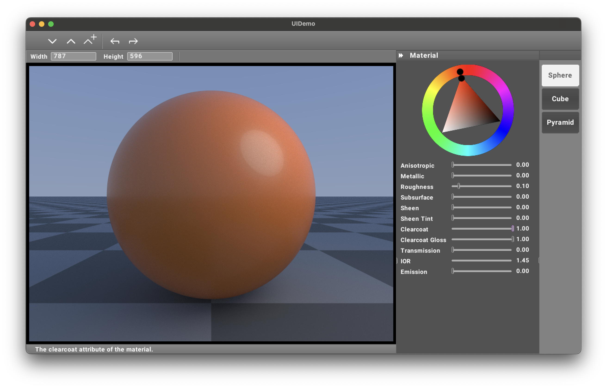
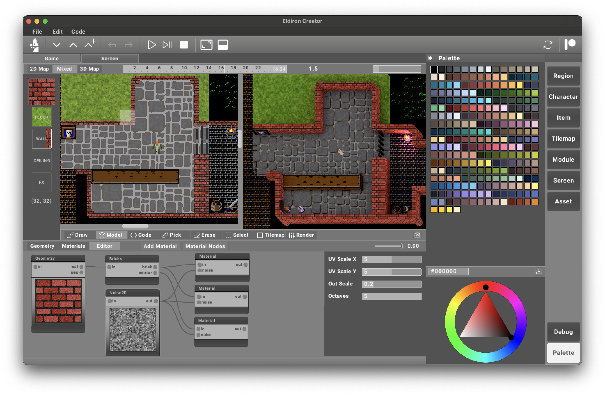

TheFramework is an abstraction layer for your application or game. You create your app inside a trait, pass it to TheFramework and it will run on all currently supported application backends.

Without any enabled options, TheFramework opens a window and provides a pixel buffer for drawing and user events (mouse, keyboard, trackpads etc). to your application trait.

### Option: ui

With the **ui** option TheFramework becomes a full-featured UI framework for professional Desktop and Web apps.

* Powerful and unique canvas based layout system
* Widgets include sliders, drop down lists, text / code edits, item lists, toolbars and menu bars and even a node editor.
* Communication via channels, create the UI, receive messages when UI elements change and sync your backend code accordingly.
* Intelligent redrawing - only redraws widgets and canvases when needed.
* Various integrated layouts.
* Style and themes enabled. Configure the UI to your IP.
* Integrated undo / redo.

The UI support is currently under development, see the *uidemo* example app.

I use TheFramework with the UI option for my own apps and games, notably [Eldiron](https://github.com/markusmoenig/Eldiron).

A dedicated demo and documentation website will come soon.

### Option: code

The **code** option adds a unique and powerful visual scripting system to TheFramework.

* Easy-to-use via drag and drop.
* Very fast as it compiles to native closures.

### Option: renderer

A fast state-based 2D renderer supporting varuous shapes and text. The development of the *renderer* option is currently on hold to focus on the *ui* first.

### Current Backends

* *Desktops* via [pixels](https://github.com/parasyte/pixels) and [winit](https://github.com/rust-windowing/winit). This is the default backend.

* *The Web*, also via [pixels](https://github.com/parasyte/pixels) and [winit](https://github.com/rust-windowing/winit).

* *Xcode*. By compiling your app into a static library you can copy and paste it into the supplied Xcode project. This project opens a Metal surface for drawing and provides native user events from the Metal surface. This allows your app to run natively on macOS, iOS and tvOS and to deliver your app directly to the given AppStores from within Xcode.

### Examples

See the [examples](./examples/) directory for the supplied examples and how to run them.

## Sponsors

None yet